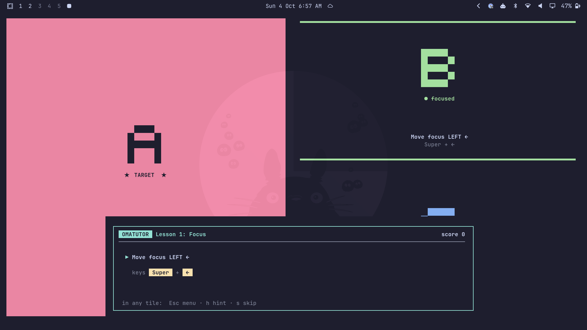
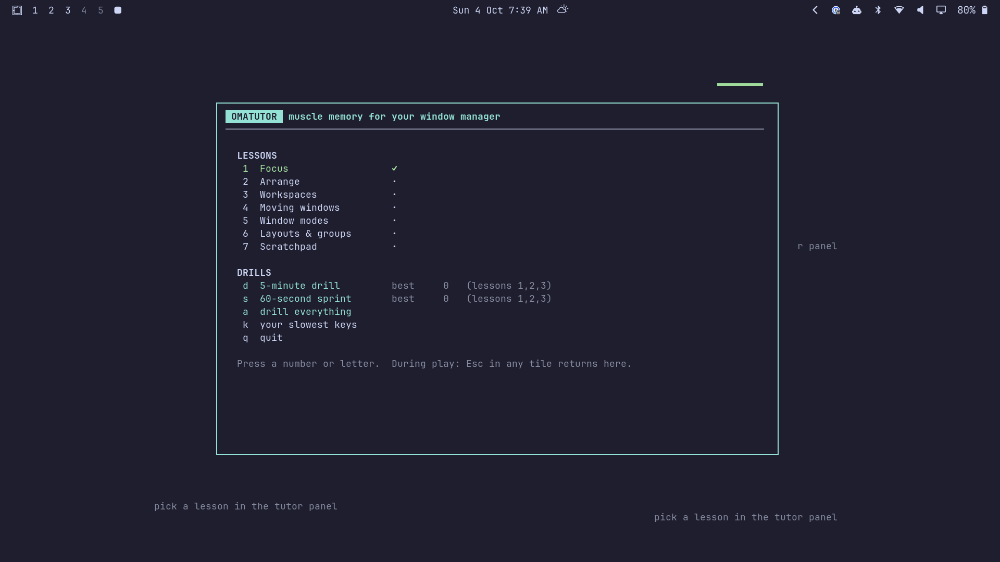
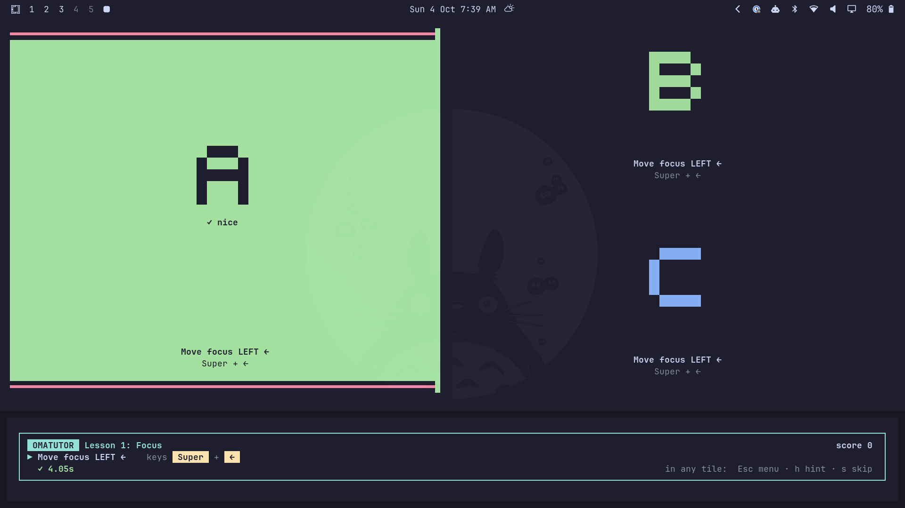
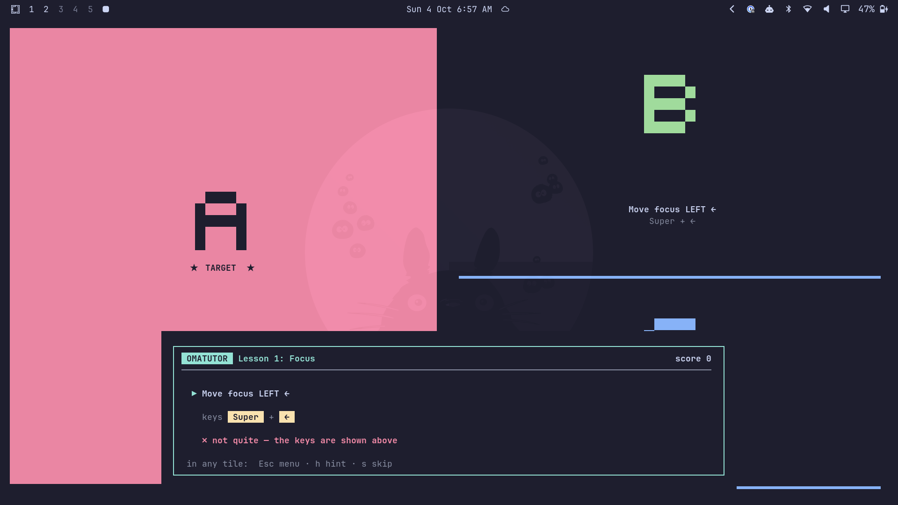
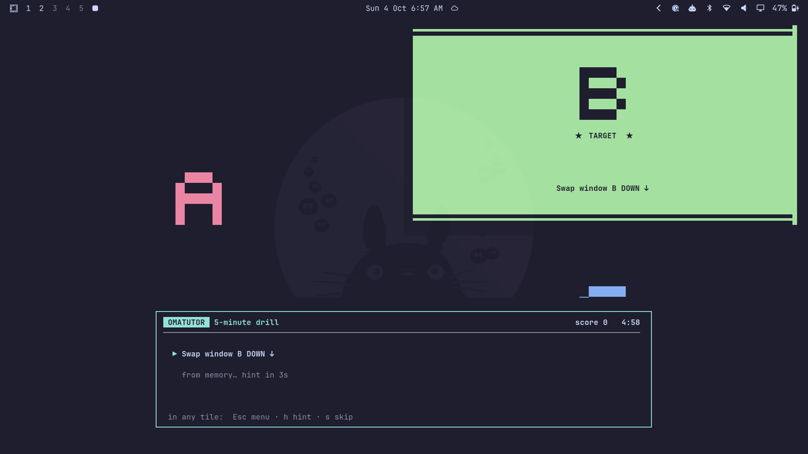
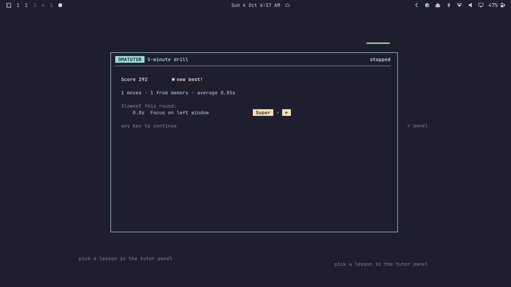
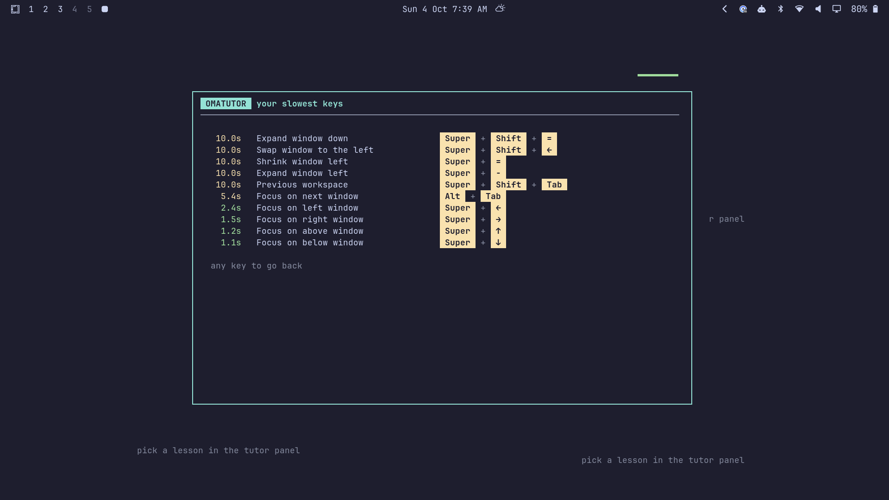

# Omatutor

A vimtutor-style game for building muscle memory with Omarchy's keybindings.

It runs inside your real Hyprland session, not a simulation. A thin panel along the bottom of the screen gives you an instruction ("Move focus LEFT ←"), you press the real keys, and Omatutor watches Hyprland's state over its IPC socket to see whether you did it. The practice windows are big lettered tiles (A, B, C) on a spare workspace. The tile you need lights up.



## Install and run

```
git clone https://github.com/briantoll/omarchy-tutor
cd omarchy-tutor
./install.sh                # puts omatutor on your PATH and in the app launcher
```

```
omatutor               # menu
omatutor drill         # straight into the 5-minute drill
omatutor sprint        # 60-second sprint
omatutor lesson 3      # a specific lesson
omatutor --reset       # forget progress
```

It needs nothing beyond Python 3 and a terminal Omarchy already ships (foot, alacritty, kitty or ghostty). Omatutor picks an empty workspace (7 if it's free), and when you quit it closes its tiles and takes you back to where you started.



## Lessons

| # | Lesson | Keys drilled |
|---|--------|--------------|
| 1 | Focus | Super + arrows, Alt + Tab |
| 2 | Arrange | Super + Shift + arrows (swap), Super + J (split), Super + - / = (resize) |
| 3 | Workspaces | Super + 1–9, Super + Ctrl + Tab (former), Super + Tab / Shift + Tab |
| 4 | Moving windows | Super + Shift + N (follow), Super + Shift + Alt + N (silent) |
| 5 | Window modes | Super + T float, Super + F full screen, Super + Alt + F full width, Super + O pop out, Super + Enter, Super + W |
| 6 | Layouts & groups | Super + L dwindle ⇄ scrolling, Super + G group, Super + Alt + arrows / Tab / G |
| 7 | Scratchpad | Super + Alt + S, Super + S |

Each lesson has two rounds. First you do every move with the keys shown, then you do them all again, shuffled, from memory.

The workspace lessons never send you into your own apps. Omatutor parks a big numbered signpost on two empty workspaces next to the practice one and only ever sends you there, and whenever you are away from the tiles the panel says where you are and which key brings you back. Super + Tab cycles through every open workspace, so for those prompts the panel also names the workspace the key will land on.

When you get it right, the tile confirms it and the panel shows your time:



If you do something other than what was asked, the panel flashes red and shows the keys. Undo it with the same key and try again. If a wrong move leaves the tiles in a mess, Omatutor tidies them up before the next prompt, and if you get properly stuck it resets the tiles and moves on.



## Drills

The **5-minute drill** and **60-second sprint** throw random moves at you from the lessons you've finished (lessons 1–3 until you've done three). The key hint stays hidden for 4 seconds. Faster answers score more, clean answers build a combo multiplier, and using the hint halves the points.



Moves you're slow on or miss come up more often (a simple Leitner-box weighting). Every round ends with your score and the moves that cost you the most time, and **k** in the menu shows your slowest keys overall.





While you're playing, press **Esc** in any tile to go back to the menu, **h** for a hint, or **s** to skip.

## How it works

- The key hints are read from your live config through `omarchy-menu-keybindings --print` (the same data as Super + K). If you rebind something, Omatutor shows your binding, but the action it checks for stays the same.
- Every step is a check on Hyprland's state (`clients`, `activewindow`, `activeworkspace`, `monitors`, `workspaces`), polled about 25 times a second over the socket.
- Tiles are terminals running `omatutor --tile X`, launched with your default terminal.
- Progress is saved in `~/.local/state/omatutor/progress.json`.

## Notes

- Anything you open on the practice workspace during a session (e.g. a terminal from a stray Super + Enter) gets closed when the tiles are reset.
- The signpost workspaces are claimed the first time a workspace exercise comes up and released when you quit.
- If the layout lesson changes the practice workspace's layout, Omatutor restores Omarchy's saved layout file for that workspace when you quit.
- Multi-monitor moves aren't drilled yet.
